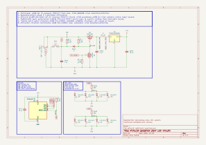

2026-09-23

# ATtiny10-pohjainen pieni LED-kilkutin

Suunniteltuna käyttökohteena killua koiran kaulapannassa ja näkyä pimeässä. Syys- ja talvisäillä musta koira uppoaa pimeyteen aika tehokkaasti.
Todellisena motivaationa tutustua matalan energian boost-konverttereihin ja pienikokoisten piirien suunnitteluun: tarkoitus olisi ajaa useampaa [~3 voltin LED:iä](https://www.digikey.fi/fi/products/detail/ams-osram-ag/KW-EELP41-RU-S1U1-3K6L-3X4X-5-R18/24765235) yhdellä nappiparistolla, niin ettei paristoa tarttisi jatkuvasti vaihtaa. Toisin sanottuna PCB:n fyysinen koko ei saisi olla paljoa nappipariston pinta-alaa isompi, ja komponenttien tulisi olla matalan mallisia.

## Rautadesign

Rautadesign on esitetty alla olevassa kytkentäkaaviossa.

</img>

1. Kun laite on poissa päältä, pariston virrat ei mene mihinkään, P-tyypin MOSFET:in Q1 hila on pariston jännitteessä.
2. Kun nappia painetaan, paristolle tarjotaan maa ja Q1 hilan jännite menee nolliin, MOSFET päästää virran läpi boostikonvertterille [TPS613222](https://www.ti.com/lit/ds/symlink/tps61322.pdf).
3. Boostikonvertteri korottaa pariston virran viiteen volttiin, mikä syötetään ATtiny10:lle.
4. ATtiny10 laittaa pinnistään N-tyypin MOSFET:in Q2 hilan korkeaan jännitteeseen, jolloin se tarjoaa Q1:lle yhteyden maahan, eli boostikonvertterin virrat pysyy päällä.
5. Kun nappia painetaan uusiksi, se vetää ATtiny10 RESET-pinnin maahan. Suoritin resettaa, mutta tunnistaa että resetin lähteenä pinnitilan muutos. Suoritin vaihtaa tilaansa seuraavaan toimintamoodiin (esim. vilkuttaa ledejä).
6. Toimintamoodeista viimeinen on se, että Q2 hila viedään maahan eikä tehdä enää mitään. Tämä sammuttaa virrat. Seuraavalla painalluksella ollaan takaisin kohdassa `2`.

LED-valot syö virtaa noin 5 mA per ledi, mitatessa oikeastaan kaikki tehokulutus tulee sieltä puolelta. Neljällä ledillä se on yhteensä noin 20 mA, ja jos CR2032 sisältää energiaa noin 220 mAh, se meinaa noin 11 tunnin käyttöikää täydellä höngällä.
Ihan OK, mutta siitä pääsee huomattavasti alespäin. Pitää ihmetellä PWM-säätöjä ja katsoa jos 1+1 tai 2+2 lediä riittäisi 4+4 sijaan.

Kokeilin tämän kohdalla uutta PCB-valmistajaa, saksalaista [AISLER](https://aisler.net/en):ia. Kohtuuhintainen ja sijaitsee Euroopassa, kattoo mitä tulee.

## Firmisdesign

Kaikki koodi tasaisesti kansiossa [src](src). Käännösympäristönä toimii `avr-gcc` Makefile kautta, ohjelmointilaitteena USB-väylään menevä [Pocet AVR programmer](https://www.sparkfun.com/pocket-avr-programmer.html).

Ohjelmointikielenä AVR assembly (avr-gcc), siten että kullakin assemblytiedostolla olisi vastaavanniminen headeri olemassa.

- Pinnien nimet `pinnit.h` ja rekisterimääritelmät `rekisterit.h`
- Interrupt-vektorin määritelmät `isr.S`
- RESET-interrupti `isr_reset.S`
- Alustusrutiinit (stack pointer, sektiot `data` ja `bss`) `init.S`
- Datamääritelmät `data.S`: siniaalto ja pari muuttujaa.
- Eri toimintamoodit `rutiinit.S`
- Päälooppi `main.S`
